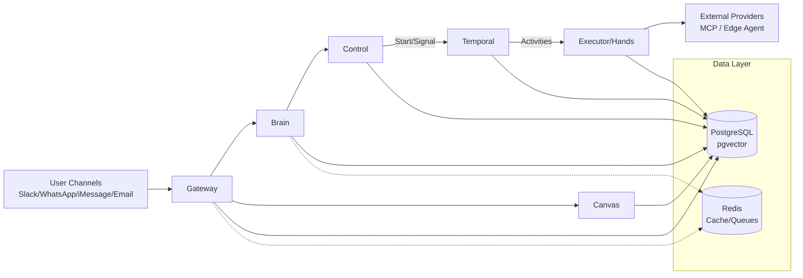

# Brevio Executive AI Agent — Architecture

## System Overview

Brevio is a multi-plane AI executive assistant platform built in Go, orchestrated by Temporal, with PostgreSQL (pgvector) as the durable state store.

## Architecture Diagram



## Plane Responsibilities

| Plane | Cmd | Description |
|-------|-----|-------------|
| Gateway | `cmd/gateway` | Ingress normalization, dedup, rate limiting, channel routing |
| Brain | `cmd/brain` | Intent classification, dual-process reasoning, plan generation |
| Control | `cmd/control` | Authorization (OPA), receipt issuance, policy enforcement |
| Executor | `cmd/executor` | Tool execution, rate coordination, latency preemption |
| Canvas | `cmd/canvas` | CRDT-based collaborative state, real-time sync |
| Temporal Worker | `cmd/temporal-worker` | Workflow/activity execution engine |
| brevioctl | `cmd/brevioctl` | CLI admin tool, verification commands |

## Data Flow

1. **Ingress**: User message arrives at Gateway via channel webhook
2. **Normalization**: Gateway validates, deduplicates, normalizes envelope
3. **Workflow Start**: Gateway starts `MessageProcessingWorkflow` via Temporal
4. **Classification**: Brain activity classifies intent with confidence scoring
5. **Planning**: Brain generates execution plan with tool keys and risk level
6. **Authorization**: Control activity issues authorization receipt (deny-by-default)
7. **Execution**: Executor activities run tools with receipt verification
8. **Synthesis**: Brain synthesizes response from tool results
9. **Delivery**: Response delivered back through originating channel

## Repository Pattern

```
Domain Package (e.g., internal/cognition/)
├── types.go          — Domain types
├── repository.go     — Repository interface
├── pg_repository.go  — pgx implementation (production)
├── service.go        — Business logic (depends on interface)
└── service_test.go   — Tests with test doubles
```

## Key Infrastructure

- **Database**: PostgreSQL 15+ with pgvector extension, pgxpool connection pooling
- **Orchestration**: Temporal Server with Go SDK workflows/activities
- **Search**: pgvector cosine similarity with IVFFlat indexes + BM25 hybrid
- **Auth**: OPA policies, RBAC, durable authorization receipts
- **IDs**: UUIDv7 (RFC 9562) for all primary keys
- **RLS**: Row-level security via `SET app.workspace_id` on every DB session
