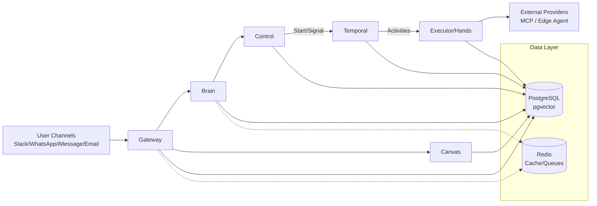
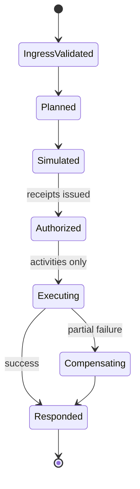

# Brevio Executive AI Agent — Architecture

## System Overview

Brevio is a multi-plane AI executive assistant platform built in Go, orchestrated by Temporal, with PostgreSQL (pgvector) as the durable state store.

## Architecture Diagram



## Plane Responsibilities

| Plane | Cmd | Description |
|-------|-----|-------------|
| Gateway | `cmd/gateway` | Ingress normalization, dedup, rate limiting, channel routing |
| Brain | `cmd/brain` | Intent classification, dual-process reasoning, plan generation |
| Control | `cmd/control` | Authorization (OPA), receipt issuance, policy enforcement |
| Executor | `cmd/executor` | Tool execution, rate coordination, latency preemption |
| Canvas | `cmd/canvas` | CRDT-based collaborative state, real-time sync |
| Temporal Worker | `cmd/temporal-worker` | Workflow/activity execution engine |
| brevioctl | `cmd/brevioctl` | CLI admin tool, verification commands |

## Data Flow — Intelligence Pipeline (P7)

1. **Ingress**: User message arrives at Gateway via channel webhook
2. **Normalization**: Gateway validates, deduplicates, normalizes envelope
3. **Workflow Start**: Gateway starts `MessageProcessingWorkflow` via Temporal
4. **Classification**: Brain activity classifies intent with confidence scoring
5. **Memory Retrieval**: FNV-1a scored, stable-sorted memory items
6. **RAG Search**: FNV-1a scored, stable-sorted retrieval chunks
7. **Reasoning Loop**: Brain generates plan with deterministic tool keys and evidence hash
8. **Cognitive Assessment**: Metacognitive load/quality/uncertainty evaluation
9. **Council Evaluation**: Multi-agent eval for CRITICAL risk or complexity > 0.7
10. **Authorization**: Control activity issues receipt (deny-by-default, 7-gate chain)
11. **Execution**: Executor runs tools with deterministic jitter and receipt verification
12. **Synthesis**: Brain synthesizes response from tool results
13. **Outbox Enqueue**: Transactional outbox entry for delivery
14. **Delivery**: Response delivered back through originating channel

## Feature Closures (P8)

| Feature | Workflow | Policy Gate | Persistence |
|---------|----------|-------------|-------------|
| Federation | `FederationNegotiationWorkflow` | Permission type validation | `federation_sync_log` |
| Edge Sync | `EdgeOfflineSyncWorkflow` | Idempotency + conflict resolution | `edge_sync_tasks` |
| Browser | `BrowserAutomationWorkflow` | Receipt enforcement | `browser_sessions` |
| Fast-Path | `FastPathPipelineWorkflow` | Latency budget (fail-fast) | `fast_path_routes` |
| Experiments | `ExperimentAssignmentWorkflow` | Deterministic FNV-1a rollout | `experiment_*` tables |
| Onboarding | `OnboardingProvisioningWorkflow` | First-value verification | `onboarding_sessions` |
| Billing | `BillingEnforcementWorkflow` | Webhook idempotency + policy gate | `billing_*` tables |
| Load Shedding | `LoadSheddingTierWorkflow` | D0-D4 tier propagation | `load_shedding_state` |

## Repository Pattern

```
Domain Package (e.g., internal/cognition/)
├── types.go          — Domain types
├── repository.go     — Repository interface
├── pg_repository.go  — pgx implementation (production)
├── service.go        — Business logic (depends on interface)
└── service_test.go   — Tests with test doubles
```

## Workflow State Diagram



## Key Infrastructure

- **Database**: PostgreSQL 16+ with pgvector extension, pgxpool connection pooling
- **Orchestration**: Temporal Server 1.30.1 with Go SDK workflows/activities
- **Search**: pgvector cosine similarity with IVFFlat/HNSW indexes + BM25 hybrid
- **Auth**: OPA policies, RBAC, durable authorization receipts
- **IDs**: UUIDv7 (RFC 9562) for all primary keys
- **RLS**: Row-level security via `SET app.workspace_id` on every DB session
- **Observability**: OpenTelemetry traces (W3C propagation), structured JSON logs, Prometheus metrics
- **Deployment**: Kubernetes with nginx ingress, Helm charts, mTLS for service-to-service auth
- **Supply Chain**: CycloneDX SBOM, dependency vulnerability scanning, container hardening

## Repository Structure

```
cmd/{gateway,brain,control,executor,canvas,temporal-worker,brevioctl}/
internal/{gateway,brain,control,executor,canvas,workflows,policy,database,observability,contracts,audit,config,security,edge,testing}/
db/migrations/                    — Forward-only production migrations
api/openapi/                      — v10.yaml canonical OpenAPI spec
schemas/                          — Strict JSON schemas
policies/                         — OPA policies + tests
infra/{terraform,helm}/           — Single canonical infra
tests/{unit,integration,e2e,contract,algorithm_fidelity}/
services/hands-runtime/           — OpenClaw TS skill runtime
edge/                             — Edge agent
apps/web-demo/                    — Demo UI
reports/                          — Generated artifacts (committed)
```

## Binding Decisions Reference

| Decision | Summary |
|----------|---------|
| D1 | Go for cloud planes; TS only for Hands/edge/frontend |
| D2 | Temporal-only orchestration with per-plane task queues |
| D3 | Control is sole PDP; durable authorization receipts |
| D4 | workspace_id RLS on all tables; fail closed |
| D5 | UUIDv7 (RFC 9562) for all primary keys |
| D6 | Forward-only migrations; rollback = snapshot + forward fix |
| D7 | FNV-1a 64-bit deterministic jitter for Temporal retries |
| D8 | OpenClaw Hands runtime with strict versioned contract |
| D9 | PostgreSQL-only production persistence (S1) |
| D10 | OpenAI embeddings + pgvector; no lexical Jaccard in prod |
